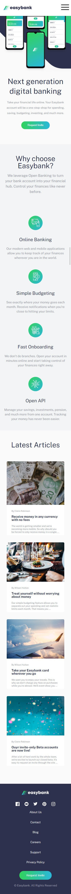

# Frontend Mentor - Easybank landing page solution

This is a solution to the [Easybank landing page challenge on Frontend Mentor](https://www.frontendmentor.io/challenges/easybank-landing-page-WaUhkoDN). Frontend Mentor challenges help you improve your coding skills by building realistic projects. 

## Table of contents

- [Frontend Mentor - Easybank landing page solution](#frontend-mentor---easybank-landing-page-solution)
  - [Table of contents](#table-of-contents)
  - [Overview](#overview)
    - [The challenge](#the-challenge)
    - [Screenshot](#screenshot)
    - [Links](#links)
  - [My process](#my-process)
    - [Built with](#built-with)
    - [What I learned](#what-i-learned)
    - [Useful resources](#useful-resources)
  - [Author](#author)

**Note: Delete this note and update the table of contents based on what sections you keep.**

## Overview

### The challenge

Users should be able to:

- View the optimal layout for the site depending on their device's screen size
- See hover states for all interactive elements on the page

### Screenshot

- Desktop screenshot :

- Mobile screenshot :
  

- Mobile screenshot showing burger menu :

### Links

- Solution URL: [Add solution URL here](https://github.com/thobenayann/easybanck-landing-page-master-react)
- Live Site URL: [Add live site URL here](https://thobenayann.github.io/easybanck-landing-page-master-react/)

## My process

### Built with

- HTML5
- CSS3 custom properties
- SASS
- Flexbox
- [React](https://reactjs.org/) - JS library

**Note: These are just examples. Delete this note and replace the list above with your own choices**

### What I learned

I learned how to make certain animations as well as interactions with svg. I also learned how to create a burger menu for mobile with nice animations.

### Useful resources

## Author

- Website - [Yann Thobena](https://thobena-yann-developpeur-web.netlify.app/)
- Frontend Mentor - [@thobenayann](https://www.frontendmentor.io/profile/thobenayann)
- Linkedin - [Yann Thobena](https://www.linkedin.com/in/yannthobena/)
